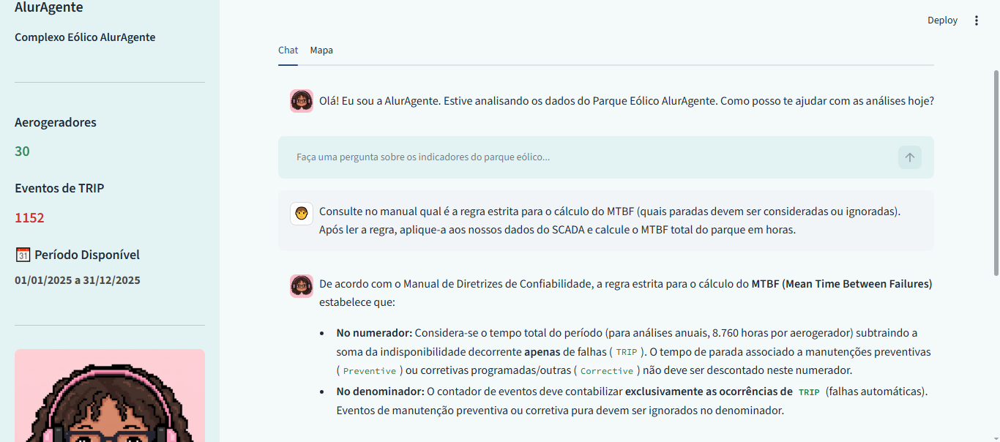
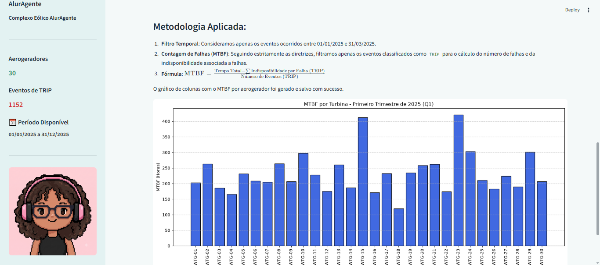
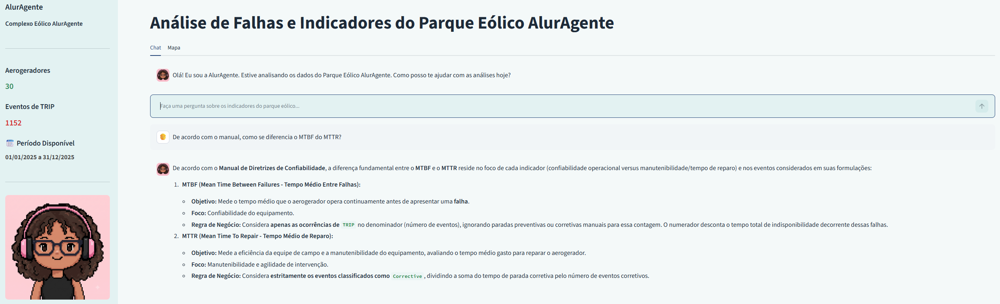
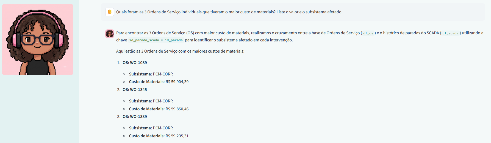
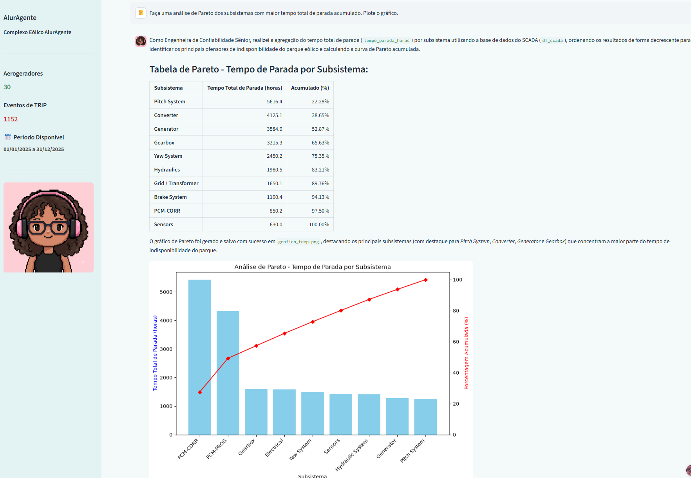

# ⚡ AlurAgente: Análise de Indicadores (O&M)


**Agente de IA para análise de dados e indicadores de manutenção em parques eólicos**, desenvolvido com **Streamlit**, **LangChain**, **Google Gemini**, arquitetura **RAG (Retrieval-Augmented Generation)** e **Pandas**.

O projeto foi desenvolvido para centralizar informações provenientes de histórico de eventos (SCADA), ordens de serviço (CMMS) e documentação técnica em uma única interface conversacional, permitindo que o usuário consulte dados, realize análises e obtenha visualizações utilizando linguagem natural.

## 🚀 Aplicação online

A aplicação está disponível para acesso através do **Streamlit Community Cloud**:

👉 **[Acessar o AlurAgente](https://challenge-aluragente-o-m-failure-analysis.streamlit.app/)**

<table>
  <tr>
    <td></td>
    <td></td>
  </tr>
</table>

---

# 📌 Sobre o Projeto

Em complexos eólicos, informações utilizadas na análise de disponibilidade, confiabilidade e custos de manutenção podem estar distribuídas em diferentes fontes. O sistema SCADA registra eventos e paradas, os sistemas CMMS concentram informações relacionadas às ordens de serviço e custos, enquanto regras e conceitos de manutenção podem estar disponíveis em documentos técnicos.

O **AlurAgente** foi desenvolvido como uma solução experimental para integrar essas fontes em um agente inteligente capaz de interpretar perguntas em linguagem natural, consultar documentação técnica, analisar dados estruturados e gerar visualizações.

A solução combina:

- 📚 **Base de conhecimento documental (RAG):** consulta ao *Manual de Diretrizes de Confiabilidade e Indicadores de Manutenção*.
- 🧠 **Inteligência Artificial Generativa:** utilização do Google Gemini para interpretação das solicitações e raciocínio analítico.
- 📊 **Análise de dados:** utilização de Pandas para leitura e processamento dos dados de SCADA e ordens de serviço.
- 📈 **Geração de gráficos:** criação de visualizações analíticas utilizando Matplotlib.
- 💻 **Interface conversacional:** aplicação web desenvolvida com Streamlit.

---

# 🚀 Funcionalidades

## 📚 Consulta à Documentação Técnica — RAG

O agente pode consultar o manual técnico utilizado como base de conhecimento para responder perguntas relacionadas a conceitos e diretrizes de confiabilidade e manutenção.

**Exemplo 1:**

> "De acordo com o manual, como se diferencia o MTBF do MTTR?"

**Resposta 1:**
<td></td>

---

## 📊 Análise de Dados — SCADA x Ordens de Serviço

O agente pode trabalhar com os DataFrames utilizados pelo projeto para realizar análises relacionadas a eventos de parada, manutenção, custos e indicadores.

Entre as análises possíveis estão:

- cálculo de MTBF e MTTR conforme as regras definidas no projeto;
- análise de tempo de parada;
- cruzamento entre histórico de paradas e ordens de serviço;
- análise de custos de materiais;
- identificação de subsistemas associados aos eventos;
- consultas e agregações sobre os dados disponíveis.

**Exemplo 2:**

> "Quais foram as 3 Ordens de Serviço individuais que tiveram o maior custo de materiais? Liste o valor e o subsistema afetado."

**Resposta 2:**
<td></td>

---

## 📈 Geração de Gráficos Analíticos

O agente pode utilizar Python, Pandas e Matplotlib para gerar visualizações a partir das análises solicitadas pelo usuário.

**Exemplo 3:**

> "Faça uma análise de Pareto dos subsistemas com maior tempo total de parada acumulado. Plote o gráfico."

**Resposta 3:**
<td></td>

---

# 🔄 Arquitetura

O projeto utiliza uma arquitetura híbrida que combina análise de dados estruturados, Retrieval-Augmented Generation (RAG), execução de código Python e LLM com tool-calling.

### Fluxo simplificado

```text
                           ┌──────────────────────────┐
                           │          Usuário          │
                           │   Pergunta em linguagem   │
                           │          natural          │
                           └────────────┬─────────────┘
                                        │
                                        ▼
                           ┌──────────────────────────┐
                           │      Google Gemini       │
                           │       LLM / Agent        │
                           │      Tool Calling        │
                           └────────────┬─────────────┘
                                        │
                         ┌──────────────┼──────────────┐
                         │              │              │
                         ▼              ▼              ▼
                  ┌─────────────┐ ┌─────────────┐ ┌─────────────┐
                  │   Pandas    │ │     RAG     │ │   Python /  │
                  │ DataFrames  │ │ PDF + FAISS │ │  Matplotlib │
                  └──────┬──────┘ └──────┬──────┘ └──────┬──────┘
                         │               │               │
                         │               ▼               │
                         │        ┌─────────────┐        │
                         │        │  Retriever  │        │
                         │        │ Busca        │        │
                         │        │ semântica   │        │
                         │        └──────┬──────┘        │
                         │               │               │
                         └───────────────┼───────────────┘
                                         │
                                         ▼
                              ┌─────────────────────┐
                              │ Resposta analítica  │
                              │ + dados + gráficos  │
                              └─────────────────────┘
```

### Etapas principais

1. **Ingestão dos dados:** os arquivos `historico_paradas_wtg.csv` e `ordens_servico_wtg.csv` são carregados com **Pandas** e disponibilizados como DataFrames para análise.
2. **Ingestão documental:** o `PyPDFLoader` extrai o conteúdo textual do documento `MANUAL DE DIRETRIZES DE CONFIABILIDADE E INDICADORES DE MANUTENÇÃO.pdf` utilizado como base de conhecimento.
3. **Chunking:** o `RecursiveCharacterTextSplitter` divide o conteúdo em **chunks** menores, utilizando `chunk_size=1000` e `chunk_overlap=200`, preparando o documento para a indexação semântica.
4. **Embeddings:** cada chunk é convertido em uma representação vetorial utilizando o modelo `gemini-embedding-001`, permitindo a comparação semântica entre consultas e trechos do documento.
5. **Indexação e recuperação:** os embeddings são indexados no **FAISS** e expostos por meio de um **retriever**, configurado para recuperar os 3 chunks mais relevantes (`k=3`) para cada consulta.
6. **Agente híbrido:** o `create_pandas_dataframe_agent` integra os DataFrames, a execução de código Python e a ferramenta de recuperação do RAG, permitindo combinar análise quantitativa e consulta à documentação técnica.
7. **Orquestração e resposta:** o **Google Gemini** interpreta a solicitação, determina quais recursos utilizar e gera a resposta com base nos dados analisados e/ou no contexto recuperado pelo RAG.

---

# 🛠️ Tecnologias e Ferramentas

| Categoria | Ferramenta / Biblioteca | Papel na Arquitetura |
| :--- | :--- | :--- |
| **Interface Web** | Streamlit | Interface interativa e renderização de dados e gráficos |
| **Orquestração de IA** | LangChain | Construção e integração do agente |
| **Inteligência Artificial** | Google Gemini | Interpretação das solicitações e geração das respostas |
| **Análise de Dados** | Pandas | Leitura, tratamento e análise dos arquivos CSV |
| **Visualização** | Matplotlib | Geração dos gráficos analíticos |
| **RAG** | LangChain + FAISS | Recuperação de informações do manual técnico |
| **Documentos** | PyPDF | Extração do conteúdo do manual em PDF |
| **Embeddings** | Google Generative AI Embeddings | Vetorização do conteúdo documental |

> **⚠️ Nota sobre os dados:** Os DataFrames e eventos de manutenção contidos neste repositório (`/data`) são dados sintéticos criados exclusivamente para a homologação da arquitetura lógica deste assistente. Eles não foram extraídos do histórico operacional de nenhum parque eólico.
---

# 📂 Estrutura do Repositório

```text
challenge-aluragente-o-m-failure-analysis/
│
├── .streamlit/
│   └── config.toml
│
├── assets/
│
├── data/
│   ├── historico_paradas_wtg.csv
│   └── ordens_servico_wtg.csv
│
├── docs/
│   └── MANUAL DE DIRETRIZES DE CONFIABILIDADE E INDICADORES DE MANUTENÇÃO.pdf
│
├── prompts/
├── scripts/
├── app.py
├── requirements.txt
├── README.md
└── .gitignore
```
---

# ⚙️ Como executar localmente

## 1. Pré-requisitos

- Python 3.10 ou superior;
- uma chave de API do Google Gemini;
- Git instalado.

## 2. Clonar o repositório

```bash
git clone https://github.com/LysaJPDataLab/challenge-aluragente-o-m-failure-analysis.git

cd challenge-aluragente-o-m-failure-analysis
```

## 3. Instalar as dependências

```bash
pip install -r requirements.txt
```

## 4. Configurar a API Key

Crie um arquivo `.env` na raiz do projeto:

```env
GOOGLE_API_KEY=sua_chave_aqui
```

## 5. Executar a aplicação

```bash
streamlit run app.py
```

Após a execução, o Streamlit disponibilizará a aplicação localmente no navegador.

---

# ☁️ Deploy

A aplicação foi publicada utilizando o **Streamlit Community Cloud**, conectado ao repositório GitHub.

Para realizar um novo deploy ou reproduzir a publicação:

1. Conecte o repositório ao Streamlit Community Cloud.
2. Selecione a branch `main`.
3. Defina `app.py` como arquivo principal.
4. Configure `GOOGLE_API_KEY` em **Secrets**.
5. O Streamlit instalará automaticamente as dependências presentes em `requirements.txt`.

---

# 🚧 Limitações e Escopo do MVP

Sendo uma Prova de Conceito (PoC) focada em validar a integração entre RAG e análise de dados tabulares, esta versão inicial apresenta algumas limitações:

*   **Memória de Sessão Volátil:** O histórico de interações é mantido apenas durante a sessão ativa no navegador (via `st.session_state`). O projeto atual não implementa um banco de dados (como SQLite ou PostgreSQL) para persistência e recuperação de chats anteriores.
*   **Renderização Única de Gráficos:** A interface plota e exibe um gráfico analítico por vez. O agente salva a visualização de forma otimizada em um arquivo temporário, sobrescrevendo-o a cada nova solicitação visual para economizar processamento.
*   **Dados Sintéticos:** As bases do SCADA e CMMS são *mockups* estruturais. Embora obedeçam à lógica operacional de parques eólicos, elas não refletem a latência, o volume massivo (Big Data) ou as anomalias de sensores de uma operação real em tempo real.
*   **Ambiguidade e Limites de Execução (Max Iterations):** Agentes estruturados para executar código Python possuem um limite de ciclos de raciocínio para evitar loops infinitos de processamento. Prompts muito amplos ou que exigem abstrações gerenciais complexas (ex: "faça um sumário geral de todos os gaps") podem esgotar esse limite de execuções antes que o agente conclua a análise de todo o Dataframe. O assistente performa com máxima precisão através de investigações analíticas sequenciais e direcionadas.

---

## 👩‍💻 Autora

**Lysara J. Pinheiro**

Projeto desenvolvido como parte do **Challenge AlurAgente** do programa **ONE - Oracle Next Education**, com foco na aplicação de Inteligência Artificial para desenvolvimento de soluções.
