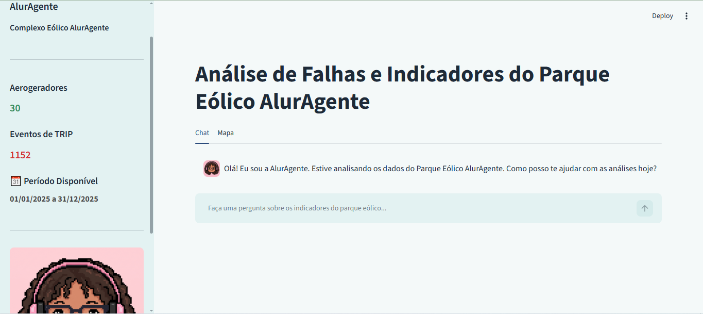

# ⚡ AlurAgente: Análise de Falhas (O&M)


Assistente inteligente para engenharia de confiabilidade de parques eólicos desenvolvido com **Streamlit**, **LangChain**, **Google Gemini**, arquitetura **RAG (Retrieval-Augmented Generation)** e **Pandas**. O projeto foi projetado para centralizar o histórico de eventos (SCADA), os custos de manutenção (CMMS) e as diretrizes teóricas em uma única interface conversacional.

A solução permite que analistas e engenheiros consultem informações, cruzem bases de dados e gerem gráficos analíticos (como Pareto) em linguagem natural, automatizando a extração de métricas a partir dos apontamentos operacionais inseridos pela equipe de campo.

<table>
  <tr>
    <td></td>
    <td></td>
  </tr>
</table>

---

# 📌 Sobre o Projeto

Em complexos eólicos, dados cruciais para o cálculo de disponibilidade e custos costumam estar distribuídos em silos: o sistema SCADA registra a indisponibilidade física (TRIPs), os sistemas CMMS gerenciam o esforço humano (Homem-Hora) e os materiais aplicados, enquanto as regras de categorização ficam isoladas em manuais em PDF.

Este projeto foi desenvolvido para unificar essas fontes de informação em um agente autônomo híbrido. O assistente é capaz de ler as diretrizes de manutenção, aplicar essas regras matematicamente aos DataFrames do parque eólico e devolver respostas precisas e visuais.

O sistema utiliza uma arquitetura híbrida que combina:
* 📚 **Base de conhecimento documental (RAG):** Leitura vetorial do *Manual de Diretrizes de Confiabilidade*.
* 🧠 **Inteligência Artificial Generativa:** LLM (Google Gemini) para raciocínio analítico estruturado (*tool-calling*).
* 📊 **Execução de Código em Python (Pandas):** Agente capacitado para ler arquivos CSV e realizar cálculos de KPIs em tempo real.
* 📈 **Geração de Gráficos:** Criação autônoma de visualizações via Matplotlib no backend.
* 💻 **Interface Web:** Aplicação interativa e rápida construída com Streamlit.

---

# 🚀 Funcionalidades

## Consulta à Documentação Técnica (RAG)
Permite realizar perguntas sobre as regras de negócio:
* Diferenciação oficial entre eventos TRIP (reativos) e preventivos;
* Diretrizes para o cálculo correto dos indicadores de manutenção.

> **Exemplo:** *"De acordo com o manual, como se diferencia uma manutenção preventiva de um TRIP para o cálculo do MTBF?"*

## Análise de Dados Cruzados (SCADA x OS)
Permite cruzar as tabelas para extrair insights financeiros e de disponibilidade:
* Cálculo autônomo de MTBF e MTTR aplicando os filtros corretos de *downtime*.
* Descoberta das causas-raiz que geraram os maiores custos de materiais (R$).

> **Exemplo:** *"Quais foram as 3 Ordens de Serviço individuais que tiveram o maior custo de materiais? Liste o valor e o subsistema afetado."*

## Geração de Gráficos Analíticos
O agente programa, desenha e renderiza análises visuais diretamente na tela do chat.

> **Exemplo:** *"Faça uma análise de Pareto dos subsistemas com maior tempo total de parada acumulado. Plote o gráfico."*

---

# 🔄 Arquitetura

O projeto é orquestrado pelo LangChain, dividindo as tarefas em ferramentas distintas para o agente do Gemini:

1. **Ingestão de Arquivos (DataFrames):** O código carrega os arquivos `historico_paradas_wtg.csv` e `ordens_servico_wtg.csv` usando Pandas.
2. **Criação da Ferramenta de Leitura (RAG):** O `PyPDFLoader` quebra o manual em pedaços, vetoriza usando embeddings do Google e salva em um banco local do FAISS, criando uma "ferramenta de busca" (`Retriever Tool`).
3. **Execução do Agente Híbrido:** O `create_pandas_dataframe_agent` une as tabelas de dados, o interpretador de código Python e a ferramenta de busca do PDF. Quando o usuário faz uma pergunta, o LLM decide se precisa pesquisar a teoria no manual, calcular a matemática nos CSVs, desenhar um gráfico, ou fazer os três simultaneamente.

---

# 🛠️ Tecnologias e Ferramentas

| Categoria | Ferramenta / Biblioteca | Papel na Arquitetura |
| :--- | :--- | :--- |
| **Interface Web** | Streamlit | Front-end interativo e renderização de dados/gráficos |
| **Orquestração de IA** | LangChain Core / Experimental | Criação do agente híbrido (*tool-calling*) |
| **Inteligência Artificial** | Google Gemini (gemini-3.5-flash-lite / gemini-embedding-001) | Cérebro analítico e vetorização de texto |
| **Análise de Dados** | Pandas & Matplotlib | Cruzamento de tabelas CSV e plotagem de gráficos |
| **Banco Vetorial (RAG)** | FAISS & PyPDF | Extração e armazenamento local do conhecimento teórico |

> **⚠️ Nota de Dados:** Os DataFrames e eventos de manutenção contidos neste repositório (`/data`) são dados sintéticos criados exclusivamente para a homologação da arquitetura lógica deste assistente. Eles não foram extraídos do histórico operacional de nenhum parque eólico.

---

# ⚙️ Como executar este projeto

Se você deseja rodar este assistente localmente, siga os passos abaixo:

### 1. Pré-requisitos
* Python 3.10 ou superior instalado.
* Uma chave de API gratuita do [Google AI Studio](https://aistudio.google.com/).

### 2. Clonando o Repositório e Configurando o Ambiente
```bash
# Clone o repositório
git clone [https://github.com/LysaJPDataLab/challenge-aluragente-o-m-failure-analysis.git](https://github.com/LysaJPDataLab/challenge-aluragente-o-m-failure-analysis.git)
cd challenge-aluragente-o-m-failure-analysis

# Instale as dependências
pip install -r requirements.txt
